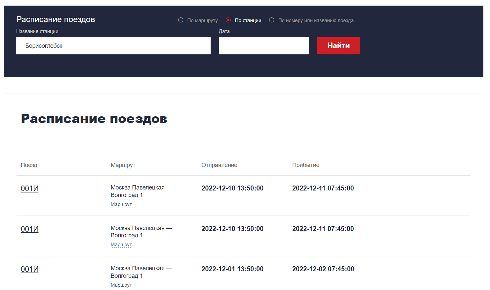
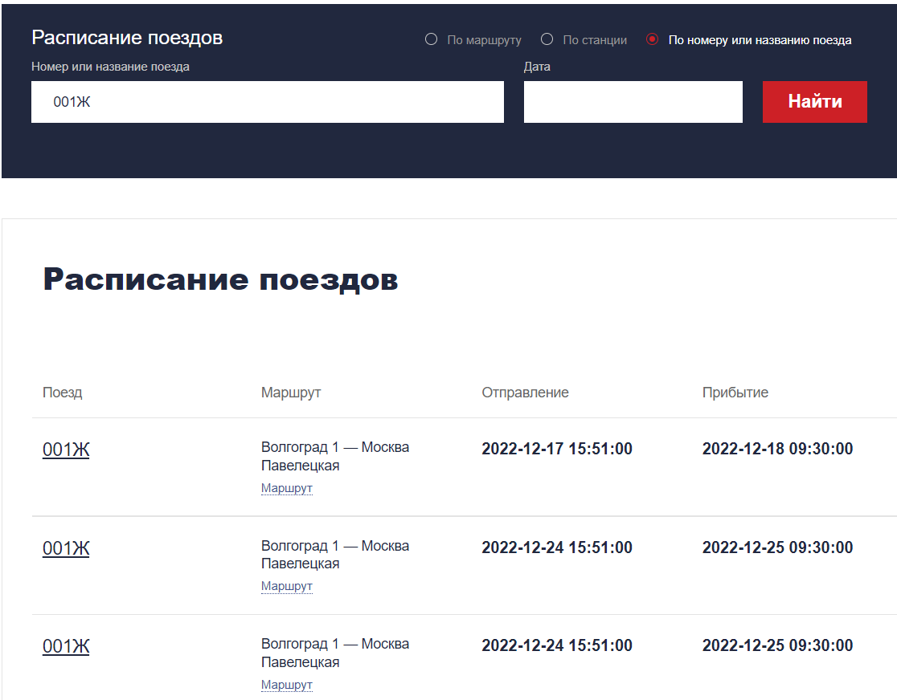
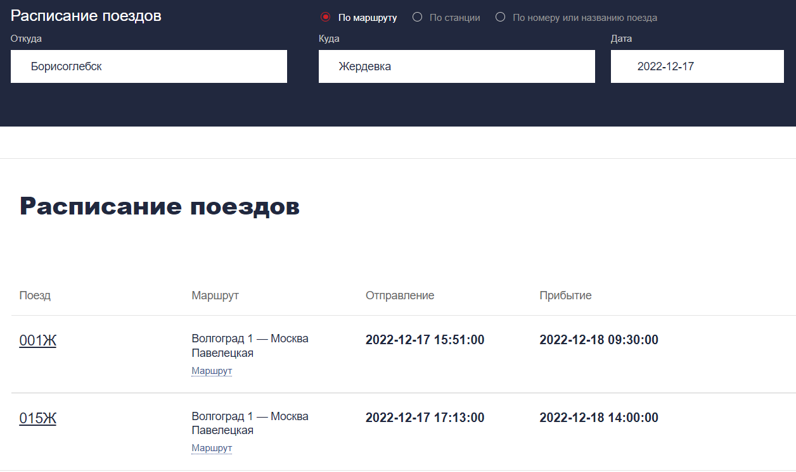

# mysql-train-schedule-app

Веб-приложение расписания поездов, написанное на Flask, MySQL, HTML/CSS. Для связи базы данных с приложением используется MySQL Connector.

Реализованы sql-запросы для поиска информации о поездах, проходящих через определенную станцию:

Поиск информации о заданном поезде:

Поиск информации о поездах, проходящих между заданными станциями в заданную дату

